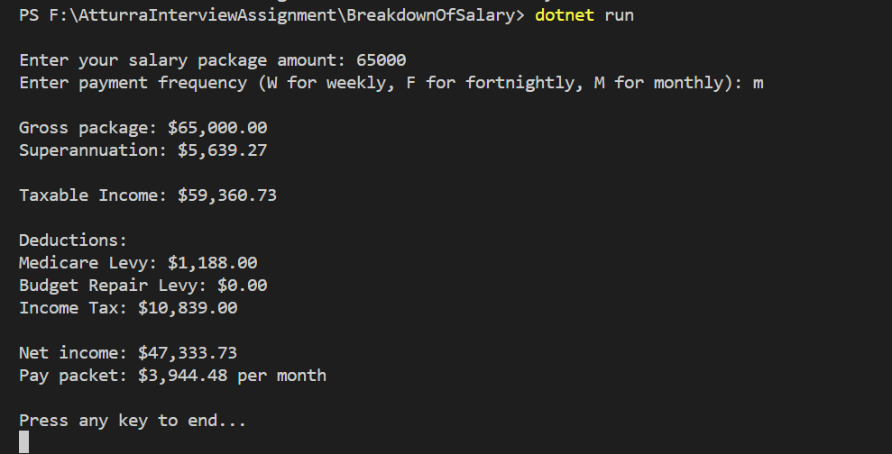

# AtturraInterviewAssignment

The 'why' of my coding decisions:
 
Due to the size of the assignment I decided to complete it all within one class (SalaryBreakdown), using several methods to break it up. each method correlates to each stage of the salary breakdown. The reason why I did them in methods is so they are easy to adjust in future updates and easy to debug.

 
How the application could be extended if the income rules change or if it were to consider future and past years:
 
The application uses different methods for each salary breakdown. This means that if any of the income rules were to change they would be able to find and adjust accordingly. As for the future and past years, there are multiple options to extend the application such as;

1. Adding a database that could hold a users breakdown of each year.
2. Adding a comparison option where users can enter their past year details and then their current year details and the system would do a side by side breakdown.

The following is a screenshot of the code running using the same inputs used in the example given in the assignment. 

(see screenshot)

